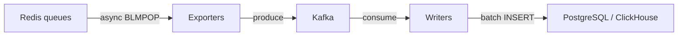
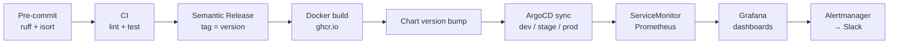

# aragog-exporters

Event-Driven Architecture for parsers-exporter-service: stateless exporters (Redis → Kafka) + database writers (Kafka → PostgreSQL/ClickHouse) on Kubernetes.

## Architecture



**5 layers separated by Kafka:**

1. **Redis** — input queues from crawlers/parsers (37 queues)
2. **Exporters** — stateless pods: validate, transform, produce to Kafka (scale 1→20 via HPA)
3. **Kafka** — shock absorber: `orgs.validated.v1` + `reviews.validated.v1` + DLQ topics
4. **Writers** — database pods: consume from Kafka, batch upsert (scale 1→12 via HPA)
5. **Observability** — Prometheus metrics, Grafana dashboards, Slack alerting

## Pipeline flow



## Tech stack

- **Python 3.10+**, asyncio, single-process per pod
- **aiokafka** — async Kafka producer/consumer
- **asyncpg** — async PostgreSQL via PgBouncer
- **clickhouse-connect** — ClickHouse native protocol
- **loguru** — structured JSON logging (Loki-compatible)
- **prometheus-client** — per-pod /metrics endpoint
- **UV** — dependency management with workspace and lockfile
- **Helm** — unified chart with per-environment values
- **HPA** — autoscaling by CPU/memory (built-in K8s, no extra operators)
- **Vault Agent Injector** — secrets injection into pods
- **ArgoCD** — GitOps deployment (dev/stage/prod)

## Project structure

```
aragog-exporters/
├── services/
│   ├── exporter-base/          Shared: async runner, Redis reader, Kafka producer
│   ├── org-exporter/           Org validation (ported from cartography.py)
│   ├── review-exporter/        Review dedup + validation (ported from reviews.py)
│   ├── pg-writer/              Kafka → PostgreSQL batch upsert
│   └── ch-writer/              Kafka → ClickHouse batch insert
├── libs/
│   ├── common/                 Models, health checks, Telegram notifier
│   └── observability/          Prometheus metrics, loguru logging
├── helm/aragog-exporters/      Unified Helm chart
│   ├── values.yaml             All 37 exporter configs
│   ├── values-dev.yaml         Dev overrides (Vault dev path)
│   ├── values-stage.yaml       Stage overrides
│   ├── values-prod.yaml        Prod overrides (Vault prod path)
│   ├── dashboards/             Grafana dashboard JSONs
│   └── templates/              K8s manifests
├── argocd/                     ArgoCD Application manifests (dev/stage/prod)
├── docker/                     Multi-stage Dockerfiles (UV-based)
├── init-scripts/               PostgreSQL + ClickHouse DDL
├── docs/                       Documentation + legacy archive
└── .github/workflows/          CI/CD pipelines
```

## Quick start (local dev)

```bash
# Start infrastructure
docker compose -f docker-compose.dev.yml up -d

# Install dependencies
uv sync

# Run an exporter locally
REDIS_URL=redis://localhost:6379 \
KAFKA_BOOTSTRAP_SERVERS=localhost:9092 \
EXPORTER_NAME=test REDIS_QUEUE=test:items \
KAFKA_TOPIC=orgs.validated.v1 SCHEMA=source_42 \
python -m services.org-exporter.main
```

## Code conventions

- **Formatter**: ruff + isort (pre-commit hooks)
- **Types**: Python 3.10+ built-in (`dict`, `list`, `tuple | None`)
- **Docstrings**: Google style on all public functions
- **Logging**: loguru only, never `print()` or stdlib `logging`
- **Banned**: `multiprocessing`, `dask`, sync Redis in exporters

## Deployment

Push to `main` → Semantic Release → Docker build (ghcr.io) → Chart version bump → ArgoCD auto-sync.

See `docs/agents.md` for the full AI agent development guide.
