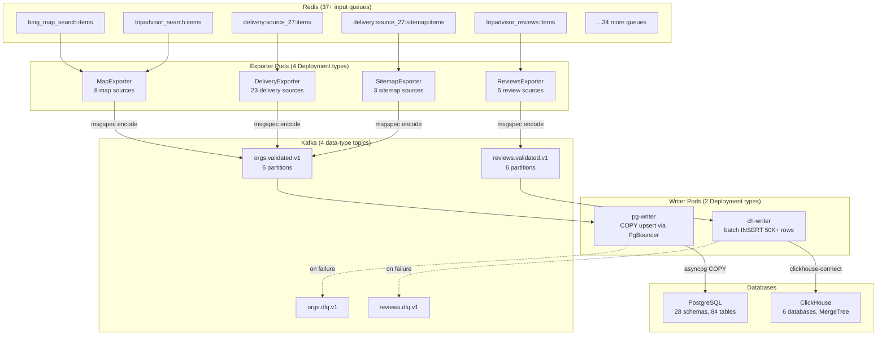
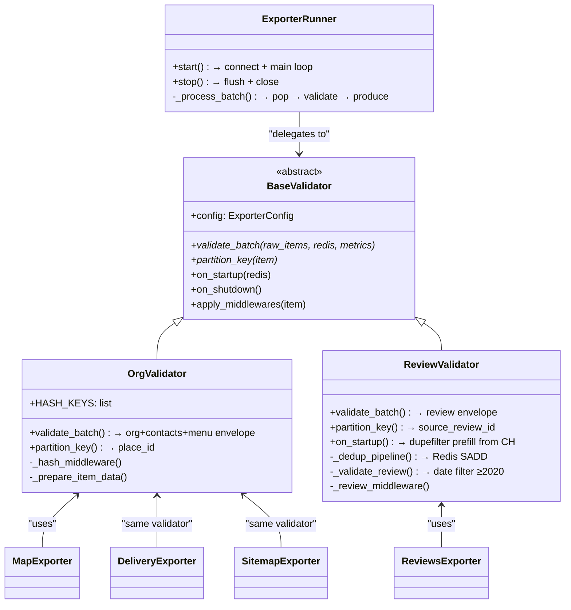
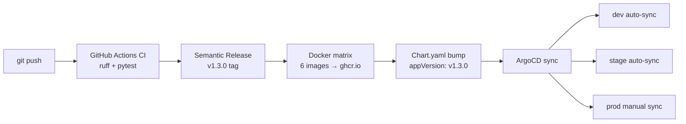

# aragog-exporters

Event-Driven pipeline for processing ~1M crawled records/hour: 37+ Redis queues
→ 4 exporter types → Kafka → PostgreSQL/ClickHouse on bare-metal Kubernetes.

## Architecture



## Exporter class hierarchy



## CI/CD pipeline



## Tech stack

- **Python 3.10+**, asyncio single event loop per pod, **uvloop** for 2-4x I/O
- **msgspec** — JSON serialization/validation (replaces orjson, 12x faster than
  Pydantic)
- **aiokafka** — async Kafka producer/consumer
- **asyncpg** — async PostgreSQL with COPY-based upsert via PgBouncer
- **clickhouse-connect** — ClickHouse native protocol (sync, in executor)
- **loguru** — structured JSON logging (Loki-compatible)
- **prometheus-client** — per-pod `/metrics` endpoint
- **UV** — dependency management with workspace and lockfile
- **Helm** — unified chart with per-environment values
- **HPA** — autoscaling by CPU/memory
- **Vault Agent Injector** — secrets injection via pod annotations
- **ArgoCD** — GitOps deployment (dev/stage/prod)
- **Semantic Release** — auto-versioning, Docker tag = Git tag = Chart
  appVersion

## Quick start

```bash
# Start infrastructure (Redis, PG, PgBouncer, CH, Kafka, Kafka UI)
docker compose -f docker-compose.dev.yml up -d

# Start full pipeline including exporters and writers
docker compose -f docker-compose.dev.yml --profile app up -d --build

# Or run a single exporter locally
uv sync
REDIS_URL=redis://localhost:16379/0 \
KAFKA_BOOTSTRAP_SERVERS=localhost:19092 \
EXPORTER_NAME=bing_map_search \
REDIS_QUEUE=bing_map_search:items \
KAFKA_TOPIC=orgs.validated.v1 \
SCHEMA=source_42 \
SOURCE_NAME="Bing Org Update" \
BATCH_SIZE=100 \
LOG_LEVEL=DEBUG \
  uv run python -m org_exporter.main
```

## Adding a new source (zero code changes)

1. Add entry to `helm/aragog-exporters/values.yaml`:
   ```yaml
   my_new_source:
       type: organization
       queue: "my_source:items"
       schema: source_99
       sourceName: "My Source"
       batchSize: 10000
   ```
2. Create PostgreSQL schema: `CREATE SCHEMA source_99` + 3 tables DDL
3. `git push` → ArgoCD syncs → new pod starts automatically

## Code conventions

- **Formatting**: ruff + isort (pre-commit hooks), line length 120
- **Types**: Python 3.10+ built-in (`dict`, `list`, `str | None`), never
  `typing.Optional`
- **Serialization**: msgspec only, never orjson/json/pydantic
- **Docstrings**: Google style on all public functions
- **Logging**: loguru only, never `print()` or stdlib `logging`
- **Banned**: `multiprocessing`, `dask`, sync Redis in exporters

## Monitoring

- **Grafana**: [dev](https://grafana.dev.k8s.rea/login) |
  [prod](https://grafana.prod.k8s.rea)
- **ArgoCD**: [dev](https://argocd.dev.rea/applications) |
  [prod](https://argocd.prod.rea/applications)
- **Vault**: [vault.rea:8200/ui](https://vault.rea:8200/ui)
- **Slack alerts**: `#parsing-exporters-dev` / `#parsing-exporters-stage` /
  `#parsing-exporters-prod`

## Deployment

| Branch    | Environment | Docker tag             | Sync   |
| --------- | ----------- | ---------------------- | ------ |
| `develop` | dev         | `dev-{sha}`            | auto   |
| `staging` | stage       | `stage-{sha}`          | auto   |
| `main`    | prod        | `v{semver}` + `latest` | manual |

See `docs/agents.md` for the full AI agent development guide.
