> **⚠️ LEGACY DOCUMENT** — Ported from parsers-exporter-service. References to docker-compose, multiprocessing, Dask, and config.yaml are outdated. See README.md for the new architecture.

# Aragog Exporter Service - Полная документация функций

## Обзор архитектуры

Aragog Exporter Service - это распределенная система обработки данных с
микросервисной архитектурой, обеспечивающая обработку данных из различных
источников (Bing, TripAdvisor, Yandex, Baidu, Yelp) с возможностью graceful
управления жизненным циклом сервисов.

### Основные компоненты

- **Enhanced Export Manager** - центральный оркестратор сервисов
- **Exporter Services** - сервисы обработки данных для каждого источника
- **Shared State Manager** - управление состояниями через Redis
- **Shared Metrics Manager** - синхронизация метрик между Dask-воркерами
- **REST API** - интерфейс управления и мониторинга
- **Process Monitor** - мониторинг процессов в реальном времени

### Документация экспортеров данных

Для детального понимания работы систем обработки данных см.
[DATA_EXPORTERS.md](DATA_EXPORTERS.md):

- **CartographyOrgDataExporter** - обработка организационных данных (PostgreSQL)
  - Bulk INSERT с ON CONFLICT UPDATE стратегией
  - Hash-based отслеживание изменений
  - Группировка данных по таблицам (organisation_data, contacts, menu)

- **ReviewsExporter** - обработка отзывов (ClickHouse)
  - Batch дедупликация через Redis Pipeline (10,000x ускорение)
  - Date filtering и партиционирование
  - Native format bulk insert

- **SharedMetricsManager Integration**
  - Reserve-range механизм для консистентных batch_id
  - Graceful fallback при недоступности shared metrics
  - Real-time мониторинг через REST API

---

## 1. State-Based Management System

### Описание

Система управления состояниями заменяет Unix сигналы на точное управление через
Redis, обеспечивая graceful операции и отслеживание состояний в реальном
времени.

### Состояния сервисов

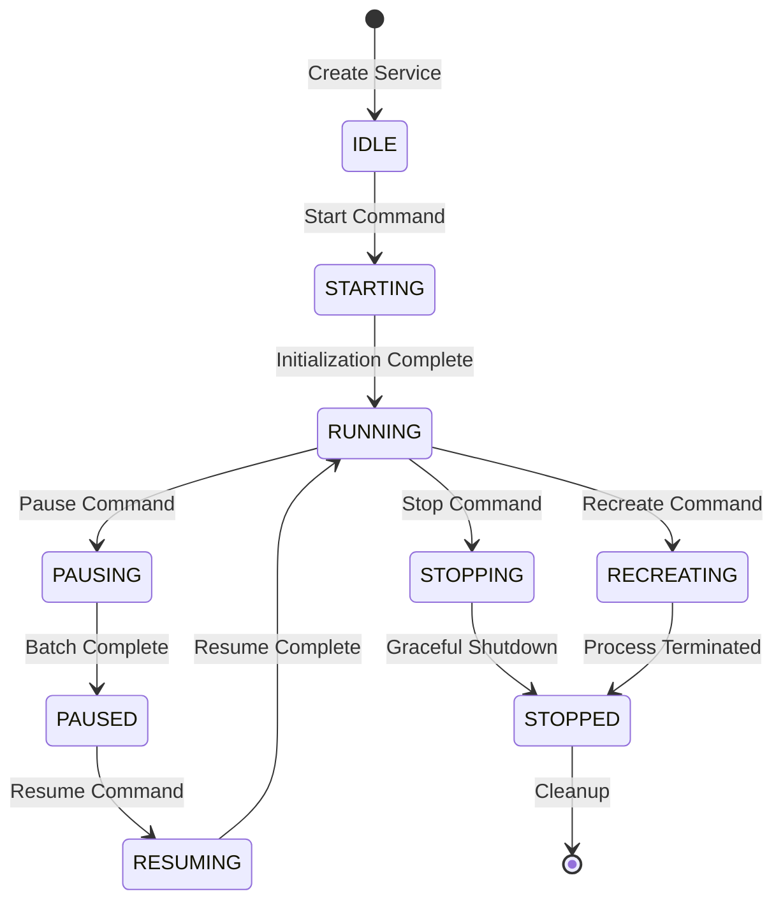

### Команды управления

- `PAUSE` - graceful пауза с ожиданием завершения батча
- `RESUME` - возобновление обработки
- `STOP` - graceful остановка сервиса
- `RECREATE` - пересоздание с перезагрузкой конфигурации

### Компоненты SharedStateManager

```python
class ServiceStateInfo:
    state: ServiceState              # Текущее состояние
    last_updated: float             # Время последнего обновления
    current_batch_processing: bool  # Флаг обработки батча
    pending_command: ServiceCommand # Ожидающая команда
    error_message: str             # Сообщение об ошибке
    metadata: Dict[str, Any]       # Дополнительные данные
```

### Пример использования

```python
# Инициализация state manager
state_manager = SharedStateManager("redis://localhost:6379")
state_manager.initialize_service("tripadvisor_reviews", ServiceState.IDLE)

# Отправка команды
state_manager.send_command("tripadvisor_reviews", ServiceCommand.PAUSE, timeout_seconds=60)

# Ожидание состояния
state_manager.wait_for_state("tripadvisor_reviews", ServiceState.PAUSED, timeout_seconds=60)
```

---

## 2. Graceful Pause System

### Описание

Система graceful паузы обеспечивает остановку обработки только после завершения
текущего батча, предотвращая потерю данных.

### Последовательность операций

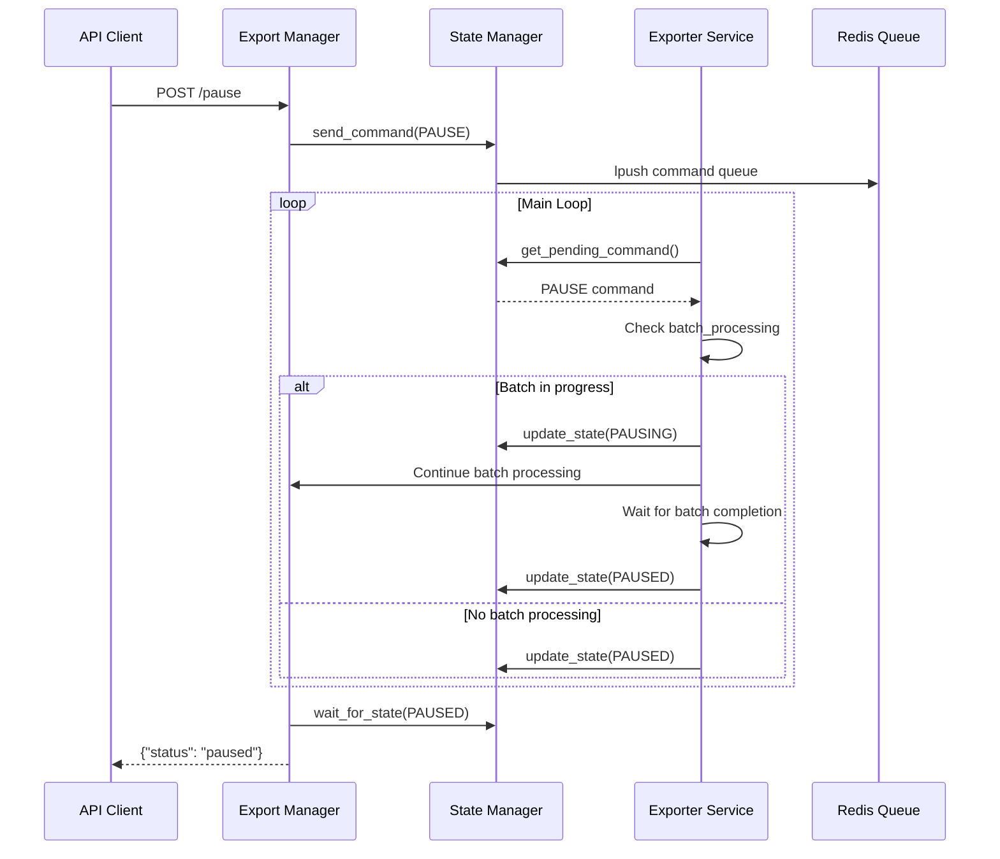

### Конфигурация

```yaml
exporters:
  tripadvisor_reviews:
    max_workers: 5
    items_per_worker: 10000 # Размер батча
    check_interval: 30 # Интервал проверки команд
    notification_trigger: 500000
```

### API использование

```bash
# Пауза одного сервиса
curl -X POST "http://localhost:8000/pause" \
  -H "Content-Type: application/json" \
  -d '{
    "spider_names": ["tripadvisor_reviews"],
    "timeout_seconds": 60
  }'

# Пауза всех сервисов
curl -X POST "http://localhost:8000/pause" \
  -H "Content-Type: application/json" \
  -d '{"timeout_seconds": 120}'
```

### Мониторинг Telegram

```
🟡 Bing Org Update (bing_map_search) pause requested, waiting for current batch to finish...
⏸️ Bing Org Update (bing_map_search) paused gracefully after batch completion
```

---

## 2.5. SharedMetricsManager - Cross-Process Metrics Synchronization

### Описание

SharedMetricsManager обеспечивает синхронизацию метрик между множественными
Dask-воркерами для точного подсчета обработанных элементов и генерации
консистентных batch_id. Использует `dask.distributed.Variable` для thread-safe
cross-process sharing.

### Проблема

До интеграции SharedMetricsManager каждый Dask-воркер:

- Независимо вычислял `batch_id` на основе локального счетчика
- Имел собственную копию `batch_timestamp` и `start_batch_id`
- Не синхронизировал общее количество обработанных элементов

**Результат:** Неконсистентные batch_id и неточная статистика.

### Решение

Все воркеры используют общие атомарные счетчики через Dask distributed
variables:

```python
# Shared variables across all workers
self.total_processed = Variable(f"{service_name}_total_processed", client=client)
self.batch_id = Variable(f"{service_name}_batch_id", client=client)
self.error_count = Variable(f"{service_name}_error_count", client=client)
self.batch_timestamp = Variable(f"{service_name}_batch_timestamp", client=client)
self.start_batch_id = Variable(f"{service_name}_start_batch_id", client=client)
```

### Архитектура интеграции

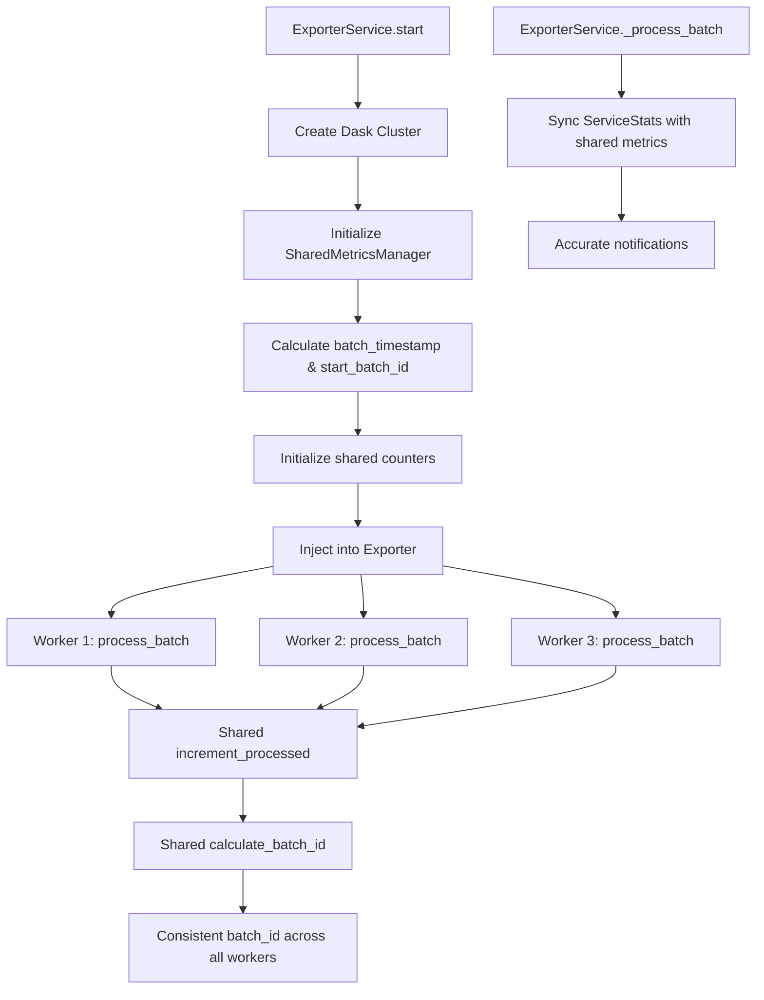

### Ключевые компоненты

#### 1. Инициализация в ExporterService.start()

```python
# Create SharedMetricsManager after Dask cluster initialization
from .utils.shared_metrics import SharedMetricsManager

self.shared_metrics = SharedMetricsManager(
    service_name=self.service_name,
    client=self.dask_client
)

# Calculate initial batch parameters once for all workers
batch_timestamp, start_batch_id = self.exporter.roundTimeStamp(roundTo=1)

# Initialize counters with shared batch parameters
self.shared_metrics.initialize_counters(
    force_reset=False,  # Don't reset if resuming from pause
    batch_timestamp=batch_timestamp,
    start_batch_id=start_batch_id
)

# Inject into exporter for use in process_batch
self.exporter.shared_metrics_manager = self.shared_metrics
```

#### 2. Использование в ReviewsExporter.process_batch()

```python
# Get shared batch parameters
if self.use_shared_metrics:
    self.batch_timestamp = self.shared_metrics_manager.batch_timestamp.get()
    self.start_batch_id = self.shared_metrics_manager.start_batch_id.get()
    self.batch_id = self.shared_metrics_manager.batch_id.get()

# Processing loop
for item in items:
    # Increment shared counter atomically
    new_total = self.shared_metrics_manager.increment_processed(1)

    # Calculate batch_id based on global total
    self.batch_id = self.shared_metrics_manager.calculate_batch_id(batch_size=500000)

    # Track errors globally
    if error:
        self.shared_metrics_manager.increment_errors(1)
```

#### 3. Синхронизация в ExporterService._process_batch()

```python
# After gathering results from all workers
results = self.dask_client.gather(futures)

# Sync with shared metrics for accurate totals
if hasattr(self, 'shared_metrics'):
    shared_stats = self.shared_metrics.get_current_stats()

    # Update service stats with global totals
    self.service_stats.total_processed_count = shared_stats['total_processed']
    self.service_stats.error_count = shared_stats['error_count']
```

### API для мониторинга

#### GET /metrics/{spider_name}

Получение детальных метрик сервиса:

```bash
curl -X GET "http://localhost:8000/metrics/tripadvisor_reviews"
```

**Response:**

```json
{
  "service_name": "tripadvisor_reviews",
  "shared_metrics_enabled": true,
  "stats": {
    "total_processed": 2500000,
    "batch_id": 5,
    "error_count": 127,
    "start_time": "2025-01-15T10:30:00",
    "batch_timestamp": "2025-01-15T10:30:00",
    "start_batch_id": 0,
    "service_name": "tripadvisor_reviews"
  },
  "batch_stats": {
    "total_processed": 2500000,
    "current_batch_id": 5,
    "start_batch_id": 0,
    "batch_timestamp": "2025-01-15T10:30:00",
    "items_in_current_batch": 0,
    "batches_completed": 5,
    "service_name": "tripadvisor_reviews"
  },
  "timestamp": "2025-01-15T12:45:30"
}
```

### Основные методы SharedMetricsManager

```python
# Атомарное инкрементирование
increment_processed(count: int = 1) -> int

# Безопасное инкрементирование (non-fatal)
safe_increment_processed(count: int = 1) -> Optional[int]

# Инкрементирование ошибок
increment_errors(count: int = 1) -> int

# Вычисление batch_id на основе total_processed
calculate_batch_id(batch_size: int = 500000) -> int

# Получение текущих метрик
get_current_stats() -> Dict[str, Any]

# Получение batch-specific статистики
get_batch_stats() -> Dict[str, Any]

# Очистка при остановке сервиса
cleanup() -> None
```

### Обратная совместимость

Все экспортеры поддерживают graceful fallback:

```python
if self.use_shared_metrics:
    # Use shared metrics for accurate totals
    new_total = self.shared_metrics_manager.increment_processed(1)
    self.batch_id = self.shared_metrics_manager.calculate_batch_id()
else:
    # Fallback to local counting
    self.stats.processed_count += 1
    self.batch_id = self.start_batch_id + self.stats.processed_count // 500000
```

### Преимущества

✅ **Консистентные batch_id** - все воркеры используют один batch_id для одного
логического батча ✅ **Точная статистика** - реальное количество обработанных
элементов across all workers ✅ **Корректные уведомления** - Telegram
уведомления с актуальными данными ✅ **Thread-safe операции** - атомарные
операции через Dask variables ✅ **Отказоустойчивость** - graceful fallback при
недоступности shared metrics ✅ **Мониторинг** - real-time visibility через REST
API

### Мониторинг Telegram

Уведомления о прогрессе теперь включают batch_id:

```
🚀 Tripadvisor progress
📦 Processed: 2,500,000
🆔 Batch ID: 5
📊 Queue Size: 150000
⚡ Speed: 1234.5 items/sec
❌ Errors: 127
⏰ Time: 12:45:30
```

---

## 3. Hot Configuration Reload

### Описание

Система горячей перезагрузки конфигурации позволяет обновлять настройки сервисов
без полной остановки системы.

### Архитектура перезагрузки

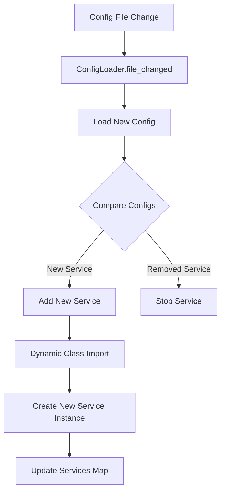

### Dynamic Class Loading

#### WARNING

> В проде shutdown_engine завязан на spider_jobs — экспортер выключается когда
> парсеры завершились и очередь пуста. В staging нет aragog-service, spider_jobs
> пустая, и are_all_parsers_finished() на пустой таблице возвращает True (exists
> на пустом множестве = False, not False = True). Из-за этого shutdown
> срабатывает сразу после обработки каждой пачки, и экспортер уходит в
> бесконечный цикл старт → обработка → shutdown → старт.

> поэтому чтобы изолировать прод процесс от стейджинга юзаем отдельный
> специальный staging триггер

```python
# Загрузка класса экспортера из конфигурации
exporter_class_path = "cartography.CartographyOrgDataExporter"
ExporterClass = import_class(exporter_class_path)
exporter = ExporterClass(config=exporter_config)

# Загрузка функции триггеров из конфигурации
trigger_function_path = "custom_triggers.setup_advanced_triggers"
trigger_function = import_class(trigger_function_path)
trigger_function(service, exporter, spider_name)

# Hot reload класса экспортера
ExporterClass = reload_class(exporter_class_path)
new_exporter = ExporterClass(config=new_config)

# Hot reload функции триггеров
trigger_function = reload_class(trigger_function_path)
# Триггеры применяются при пересоздании сервиса
```

### API управление

```bash
# Ручная перезагрузка конфигурации
curl -X POST "http://localhost:8000/config/reload"

# Принудительная перезагрузка конкретного сервиса
curl -X POST "http://localhost:8000/config/reload?spider_name=tripadvisor_reviews"
```

### Hot Reload для триггеров

Система поддерживает горячую перезагрузку триггерных функций через те же
механизмы:

#### Изменения в конфигурации

```yaml
# До изменения
service_name:
  trigger_function_path: "basic_triggers.setup_simple_triggers"

# После изменения
service_name:
  trigger_function_path: "advanced_triggers.setup_complex_triggers"
```

#### Применение изменений

- **Автоматически**: при изменении `config.yaml` (если включен file watcher)
- **Через API**: `POST /config/reload` - перезагружает конфигурацию
- **Через recreate**: `POST /recreate` - полное пересоздание с новыми триггерами

#### Особенности hot reload триггеров

- Триггеры перезагружаются только при **пересоздании сервиса**
- Изменение `trigger_function_path` требует **recreate** для применения
- Изменение `auto: true/false` влияет на активацию/деактивацию триггеров
- Новые триггерные модули импортируются динамически

---

## 4. Service Recreate System

### Описание

Система пересоздания сервисов обеспечивает полную перезагрузку сервиса с новой
конфигурацией и hot reload кода.

### Режимы работы

#### Graceful Recreate (по умолчанию)

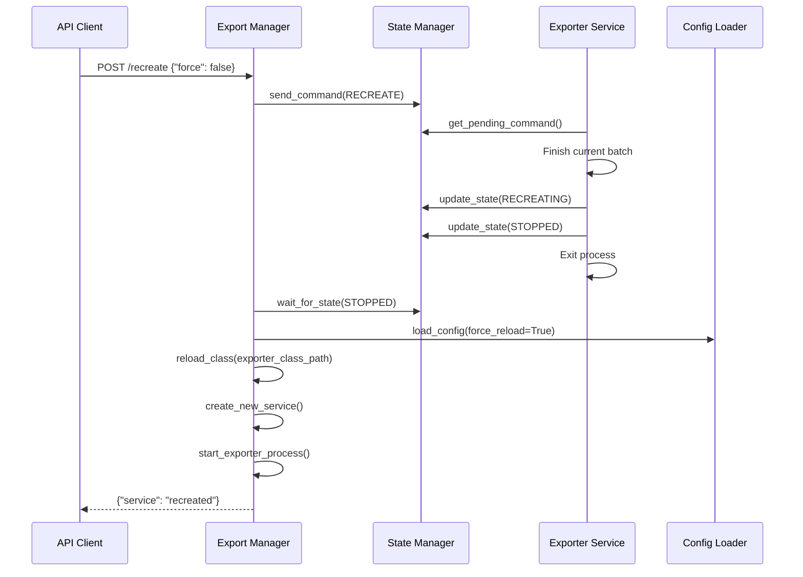

#### Force Recreate

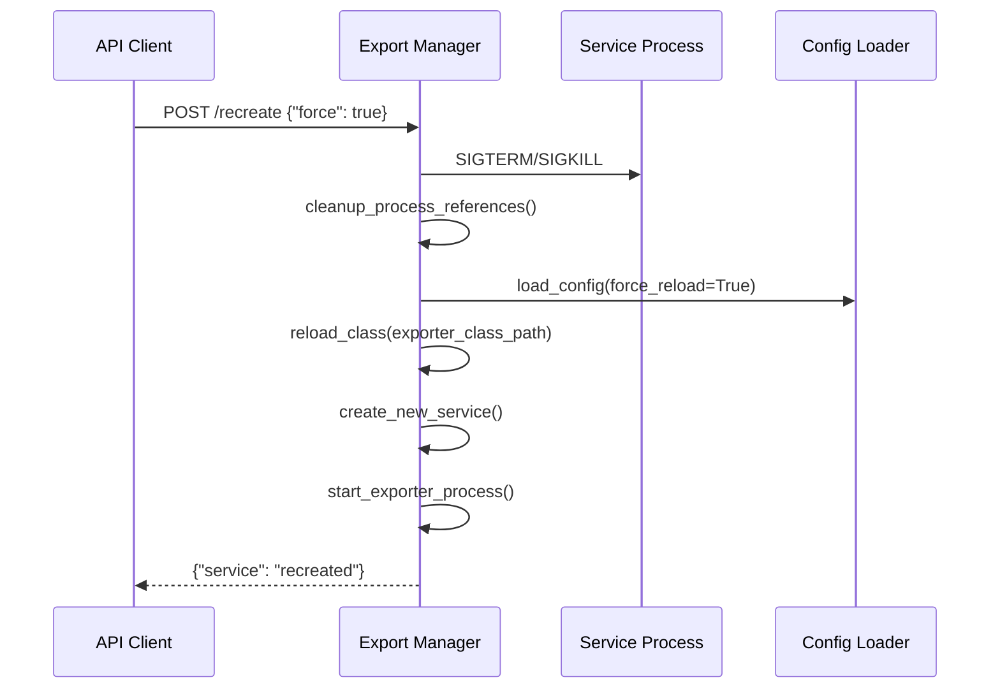

### API использование

```bash
# Graceful recreate
curl -X POST "http://localhost:8000/recreate" \
  -H "Content-Type: application/json" \
  -d '{
    "spider_names": ["tripadvisor_reviews"],
    "timeout_seconds": 120,
    "force": false
  }'

# Force recreate (немедленная остановка)
curl -X POST "http://localhost:8000/recreate" \
  -H "Content-Type: application/json" \
  -d '{
    "spider_names": ["tripadvisor_reviews"],
    "force": true
  }'
```

### Уведомления

**Graceful recreate:**

```
🔄 Manager: Gracefully recreating service Tripadvisor (tripadvisor_reviews)
🔄 Hot Reload: Reloaded exporter class for tripadvisor_reviews
✅ Service Recreated: tripadvisor_reviews (Tripadvisor)
```

**Force recreate:**

```
⚡ Manager: Force recreating service Tripadvisor (tripadvisor_reviews)
✅ Service Recreated: tripadvisor_reviews (Tripadvisor)
```

---

## 5. Graceful Shutdown System

### Описание

Система graceful остановки обеспечивает корректное завершение работы всех
сервисов с сохранением данных.

### Архитектура shutdown

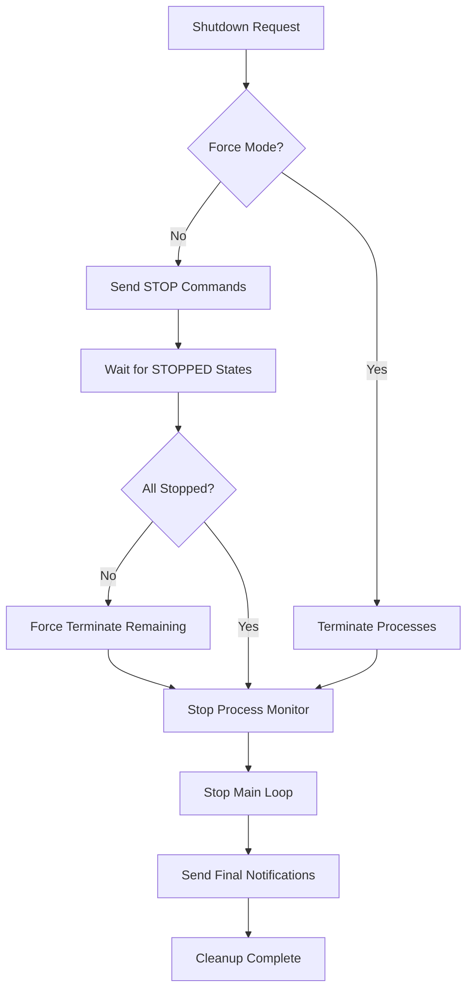

### Последовательность graceful shutdown

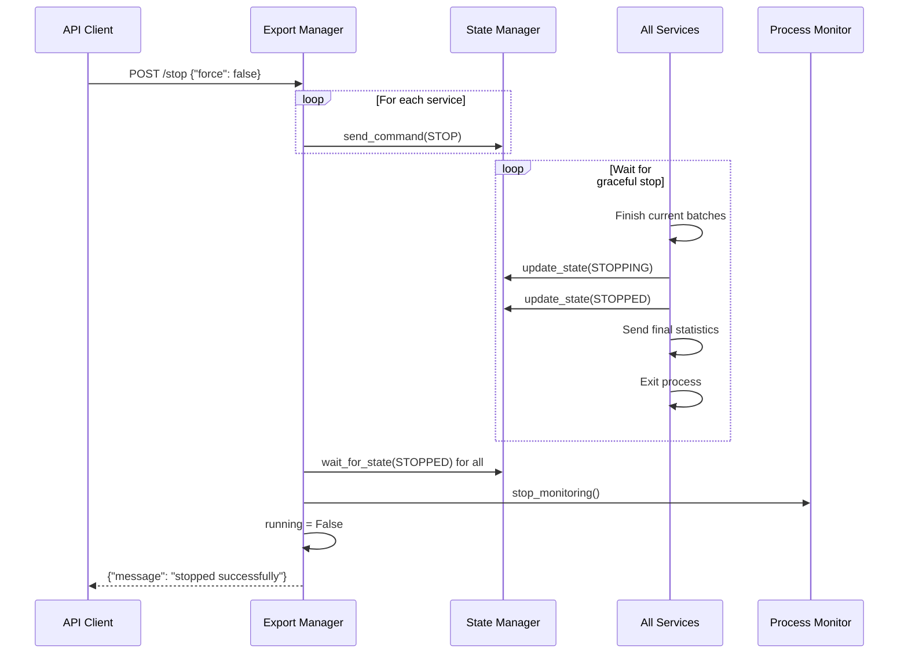

### API использование

```bash
# Graceful shutdown
curl -X POST "http://localhost:8000/stop" \
  -H "Content-Type: application/json" \
  -d '{
    "timeout_seconds": 60,
    "force": false
  }'

# Force shutdown
curl -X POST "http://localhost:8000/stop" \
  -H "Content-Type: application/json" \
  -d '{
    "force": true
  }'
```

### Интеграция с системными сигналами

```bash
# В enhanced_main_with_graceful_stop.py
kill -TERM <pid>    # Graceful shutdown
kill -INT <pid>     # Graceful shutdown (Ctrl+C)
kill -USR1 <pid>    # Force shutdown
```

---

## 6. Process Monitoring System

### Описание

ThreadedProcessMonitor обеспечивает непрерывный мониторинг состояния процессов
сервисов и автоматический перезапуск в случае сбоев.

### Архитектура мониторинга

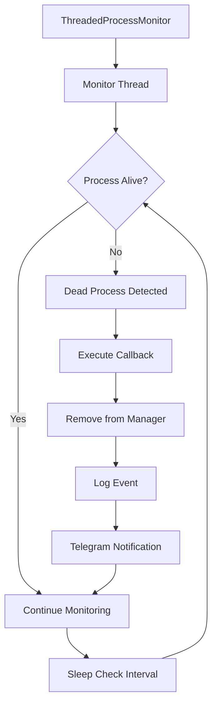

### Функции мониторинга

```python
class ThreadedProcessMonitor:
    def register_process(self, name: str, process: Process, callback: Callable)
    def unregister_process(self, name: str)
    def start_monitoring(self)
    def stop_monitoring(self)
```

### Автоматический перезапуск

При обнаружении мертвого процесса:

1. Вызывается callback функция
2. Процесс удаляется из списка активных
3. Отправляется уведомление в Telegram
4. Manager может запустить новый процесс при следующей проверке условий

---

## 7. REST API Interface

### Полный список endpoints

```yaml
Health & Status:
  GET /health: Проверка состояния системы
  GET /status: Общий статус менеджера
  GET /status/{spider_name}: Статус конкретного сервиса
  GET /services: Статус всех сервисов

Service Control:
  POST /pause: Пауза сервисов
  POST /resume: Возобновление сервисов
  POST /start: Ручной запуск сервисов (для auto=false или принудительный)
  POST /recreate: Пересоздание сервисов
  POST /stop: Остановка всей системы

Configuration:
  POST /config/reload: Перезагрузка конфигурации

Statistics:
  POST /stats/send: Отправка общей статистики
  POST /stats/send/{spider_name}: Статистика конкретного сервиса
```

### Модели данных

```python
class ExporterServiceInfo(BaseModel):
    spider_name: str
    status: ServiceStatus
    queue_size: int
    total_processed: int
    error_count: int
    workers_count: int
    last_activity: Optional[str]

class ManagerStatus(BaseModel):
    status: ServiceStatus
    active_services: List[str]
    paused_services: List[str]
    total_services: int
    manager_uptime: str
```

### Примеры использования

```bash
# Получение статуса всех сервисов
curl -X GET "http://localhost:8000/services"

# Получение статуса конкретного сервиса
curl -X GET "http://localhost:8000/status/tripadvisor_reviews"

# Отправка статистики в Telegram
curl -X POST "http://localhost:8000/stats/send"
```

---

## 8. Telegram Integration

### Описание

Интеграция с Telegram обеспечивает уведомления в реальном времени о состоянии
системы, статистике обработки и событиях управления.

### Типы уведомлений

#### Управление сервисами

```
🚀 Starting Export Service for tripadvisor_reviews
⏸️ Manager: Sending pause command to Tripadvisor (tripadvisor_reviews)
▶️ Manager: Sending resume command to Tripadvisor (tripadvisor_reviews)
🔄 Manager: Recreating service Tripadvisor (tripadvisor_reviews)
🛑 Graceful Shutdown: Stopping Enhanced Export Manager and all services
```

#### Статистика обработки

```
🚀 Tripadvisor progress
📦 Processed: 1,500,000
📊 Queue Size: 45,230
⚡ Speed: 125.5 items/sec
❌ Errors: 12
⏰ Time: 14:30:25
```

#### Системные события

```
🔄 Configuration reloaded successfully
⚠️ Enhanced Export Manager loop error
❌ Error: Failed to connect to database
```

#### Финальные отчеты

```
🛑 Tripadvisor final report
✅ Total processed: 2,350,000
❌ Total errors: 156
🕒 Shutdown time: 2025-01-15 16:45:30
```

### Конфигурация

```yaml
telegram:
  bot_token: "${TELEGRAM_BOT_TOKEN}"
  chat_id: "${TELEGRAM_CHAT_ID}"
```

---

## 9. Multi-Database Support

### Описание

Система поддерживает различные типы баз данных для разных типов данных:
PostgreSQL для организационных данных и ClickHouse для аналитических данных
(отзывы).

### Архитектура данных

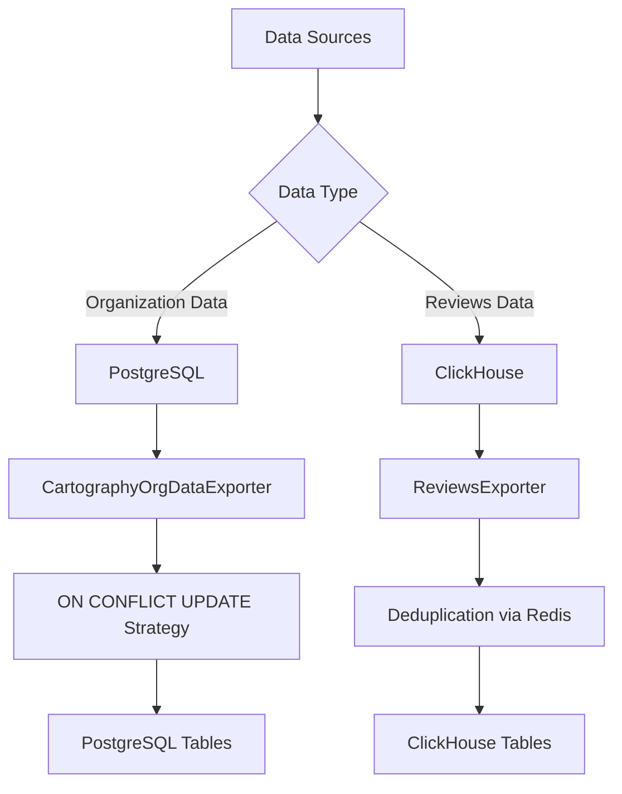

### Типы экспортеров

#### Organization Data Exporter

```python
class CartographyOrgDataExporter(BaseExporter):
    # PostgreSQL connection
    # Bulk insert with ON CONFLICT UPDATE
    # Conflict resolution strategies
```

#### Reviews Data Exporter

```python
class ReviewsExporter(BaseExporter):
    # ClickHouse connection
    # Deduplication via Redis sets
    # Bulk insert optimization
```

### Конфигурация экспортеров

```yaml
# Organization data (PostgreSQL)
bing_map_search:
  type: "organization"
  exporter_class_path: "cartography.CartographyOrgDataExporter"
  pg_url: "${PG_222_URI}"
  conflict_strategy: "update"

# Reviews data (ClickHouse)
tripadvisor_reviews:
  type: "reviews"
  exporter_class_path: "reviews.ReviewsExporter"
  ch_dict:
    host: "${CLICKHOUSE_HOST}"
    port: "${CLICKHOUSE_PORT}"
    username: "${CLICKHOUSE_USER}"
    password: "${CLICKHOUSE_PASSWORD}"
    database: "source_33"
  dupefilter_key: "tripadvisor:reviews_dupefilter"
```

---

## 10. Distributed Processing

### Описание

Система использует Dask для распределенной обработки данных с динамическим
управлением количеством воркеров.

### Динамическое масштабирование

```python
def _get_required_workers(self) -> int:
    queue_size = self.redis_conn.llen(self.exporter.config.queue_name)
    if queue_size == 0:
        return 0

    required = queue_size // self.exporter.config.items_per_worker
    required = max(1, required)  # Минимум 1 воркер
    return min(required, self.exporter.config.max_workers)
```

### Обработка батчей

```python
def _process_batch(self):
    required_workers = self._get_required_workers()
    
    futures = [
        self.dask_client.submit(
            self.exporter.process_batch,
            pure=False,
            workers=[worker_id],
        )
        for worker_id in range(required_workers)
    ]
    
    results = self.dask_client.gather(futures)
```

---

## 11. Configuration Management

### Описание

Гибкая система управления конфигурацией с поддержкой переменных окружения, hot
reload и валидации.

### Структура конфигурации

```yaml
exporters: # Конфигурация экспортеров
  service_name:
    type: "organization|reviews"
    exporter_class_path: "module.ClassName"
    trigger_function_path: "module.function_name" # Опциональное поле (default: default_triggers.setup_default_triggers)
    auto: true # Автоматический запуск по триггерам (default: true)
    redis_url: "${REDIS_URI}"
    pg_url: "${PG_URI}" # Для organization
    ch_dict: { ... } # Для reviews
    queue_name: "service:items"
    dupefilter_key: "service:dupefilter" # Ключ для фильтра дубликатов
    max_workers: 5
    items_per_worker: 10000
    check_interval: 30
    notification_trigger: 500000
    dupefilter_prefill: # Конфигурация предзаполнения фильтра дубликатов (опционально)
      source_id: "source_33"
      prefill_function_path: "module.function_name" # Опционально

manager: # Настройки менеджера
  check_interval: 40

telegram: # Telegram интеграция
  bot_token: "${TELEGRAM_BOT_TOKEN}"
  chat_id: "${TELEGRAM_CHAT_ID}"
```

### Новые конфигурационные поля

#### trigger_function_path (опционально)

- **Описание**: Путь к функции настройки триггеров для автоматических сервисов
- **По умолчанию**:
  `"aragog_exporter_service.utils.default_triggers.setup_default_triggers"`
- **Применимость**: Только для сервисов с `auto: true`
- **Формат**: `"module.function_name"` (аналогично `exporter_class_path`)

**Примеры:**

```yaml
# Дефолтные триггеры (можно не указывать)
standard_service:
  auto: true
  # trigger_function_path автоматически = default_triggers.setup_default_triggers

# Кастомные триггеры
time_based_service:
  auto: true
  trigger_function_path: "my_triggers.setup_time_based_triggers"

# Ручной сервис (trigger_function_path игнорируется)
manual_service:
  auto: false
  trigger_function_path: "ignored.for.manual.services"
```

#### auto (опционально)

- **Описание**: Определяет режим запуска сервиса
- **По умолчанию**: `true` (автоматический режим)
- **Значения**:
  - `true` - автоматический запуск по триггерам
  - `false` - только ручной запуск через API `/start`

**Логика работы:**

- `auto: true` → Триггеры активны → Автоматическое управление
- `auto: false` → Триггеры отключены → Только ручное управление

**Use cases для auto: false:**

- Тестовые сервисы
- Batch обработка по расписанию
- CI/CD интеграция
- Maintenance задачи

#### dupefilter_prefill (опционально)

- **Описание**: Конфигурация предварительного заполнения фильтра дубликатов для
  конкретного экспортёра
- **По умолчанию**: `null` (без предзаполнения)
- **Применимость**: Только для сервисов с настроенным `dupefilter_key`
- **Выполнение**: При создании сервиса (startup, hot reload, recreate)

**Структура:**

```yaml
dupefilter_prefill:
  source_id: "source_33" # ID источника данных (обязательно)
  prefill_function_path: "module.function_name" # Путь к функции prefill (опционально)
  # Дополнительные параметры передаются в функцию prefill
  batch_size: 10000
  custom_param: "value"
```

**Автоматическое определение функций prefill:**

- Если `prefill_function_path` не указан, система автоматически определяет
  функцию по типу экспортёра
- `reviews` →
  `"aragog_exporter_service.utils.dupefilter_prefill_loader.fill_reviews_dupefilter_by_source"`
- `organization` → функция prefill не применяется

**Примеры использования:**

```yaml
# Reviews с автоматической функцией prefill
tripadvisor_reviews:
  type: "reviews"
  dupefilter_key: "tripadvisor:reviews_dupefilter"
  dupefilter_prefill:
    source_id: "source_33"

# Reviews с кастомной функцией prefill
yandex_reviews:
  type: "reviews"
  dupefilter_key: "yamap:reviews_dupefilter"
  dupefilter_prefill:
    source_id: "source_47"
    prefill_function_path: "custom_prefills.yamap_dupefilter"
    batch_size: 5000

# Organization без prefill (не применимо)
org_service:
  type: "organization"
  # dupefilter_prefill отсутствует
```

### ConfigLoader возможности

```python
class ConfigLoader:
    def load_config(self, force_reload: bool = False) -> SystemConfig
    def _file_changed(self) -> bool
    def get_exporter_type(self, spider_name: str) -> str
```

---

## 12. Manual Service Control & Auto-Start Configuration

### Описание

Система поддерживает два режима запуска сервисов: автоматический (по триггерам)
и ручной (через API). Флаг `auto` в конфигурации сервиса определяет режим его
работы и управления.

### Режимы запуска сервисов

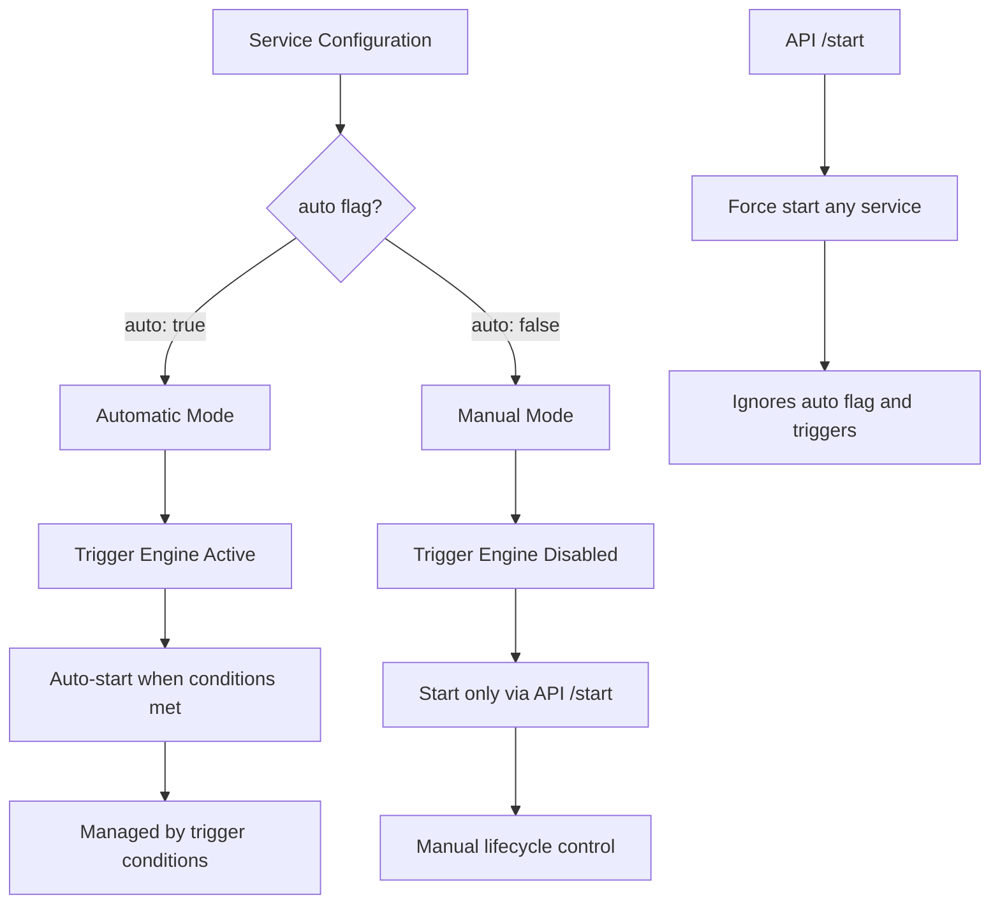

### Конфигурация auto флага

#### Автоматические сервисы (auto: true - по умолчанию)

```yaml
exporters:
  # Явное указание auto: true (можно не указывать)
  tripadvisor_reviews:
    type: "reviews"
    auto: true # Автоматический запуск по триггерам
    exporter_class_path: "reviews.ReviewsExporter"
    redis_url: "${REDIS_252_URI}"
    queue_name: "tripadvisor_reviews:items"
    max_workers: 5
    source_name: "Tripadvisor"

  # Без указания auto (default: true)
  yandex_map_reviews:
    type: "reviews"
    # auto: true по умолчанию
    exporter_class_path: "reviews.ReviewsExporter"
    redis_url: "${REDIS_252_URI}"
    queue_name: "yandex_map_reviews:items"
    max_workers: 5
    source_name: "Yandex Maps"
```

#### Ручные сервисы (auto: false)

```yaml
exporters:
  # Тестовый сервис - только ручной запуск
  test_service:
    type: "organization"
    auto: false # Требует ручного запуска через API
    exporter_class_path: "cartography.CartographyOrgDataExporter"
    redis_url: "${REDIS_252_URI}"
    pg_url: "${PG_222_URI}"
    queue_name: "test_service:items"
    max_workers: 1
    source_name: "Test Service"
    schema: "test_schema"

  # Периодическая задача - контролируется внешней системой
  maintenance_task:
    type: "organization"
    auto: false # Запускается по расписанию внешней системой
    exporter_class_path: "cartography.CartographyOrgDataExporter"
    redis_url: "${REDIS_252_URI}"
    pg_url: "${PG_222_URI}"
    queue_name: "maintenance:items"
    max_workers: 2
    source_name: "Maintenance Task"
```

### API ручного управления

#### Endpoint POST /start

```bash
# Запуск одного сервиса
curl -X POST "http://localhost:8000/start" \
  -H "Content-Type: application/json" \
  -d '{
    "spider_names": ["test_service"]
  }'

# Запуск нескольких сервисов
curl -X POST "http://localhost:8000/start" \
  -H "Content-Type: application/json" \
  -d '{
    "spider_names": ["test_service", "maintenance_task"]
  }'

# Принудительный запуск автоматического сервиса
curl -X POST "http://localhost:8000/start" \
  -H "Content-Type: application/json" \
  -d '{
    "spider_names": ["tripadvisor_reviews"]
  }'
```

#### Ответы API

```json
{
  "test_service": "started",
  "maintenance_task": "started",
  "running_service": "already running",
  "unknown_service": "service not found"
}
```

### Логика работы системы

#### Автоматические сервисы (auto: true)

1. **Проверка триггеров** - каждые `manager.check_interval` секунд
2. **Оценка условий** - `trigger_engine.evaluate()` для каждого сервиса
3. **Автоматический запуск** - при срабатывании триггеров
4. **Автоматическое завершение** - при срабатывании shutdown триггеров

#### Ручные сервисы (auto: false)

1. **Пропуск проверки триггеров** - система игнорирует trigger_engine
2. **Запуск только через API** - требует явного вызова `/start`
3. **Ручное управление жизненным циклом** - остановка через `/pause`, `/stop`
4. **Контроль внешними системами** - интеграция с планировщиками задач

### Use Cases

#### Автоматические сервисы (auto: true)

- **Продакшн сервисы** - обрабатывают данные по мере поступления
- **Реактивные системы** - реагируют на изменения в очередях
- **Постоянные процессы** - требуют непрерывной работы

```yaml
production_reviews:
  auto: true # Автоматическая обработка поступающих отзывов
  trigger_function_path: "default_triggers.setup_default_triggers"
```

#### Ручные сервисы (auto: false)

- **Тестовые сервисы** - запуск для отладки и тестирования
- **Batch задачи** - однократная обработка данных
- **Maintenance задачи** - периодическое обслуживание
- **Сервисы с внешним управлением** - интеграция с CI/CD, cron

```yaml
# Тестовый сервис
test_data_processor:
  auto: false # Запуск только для тестирования

# Ночная обработка данных
nightly_aggregation:
  auto: false # Запуск по cron в 02:00

# CI/CD интеграция
data_validation:
  auto: false # Запуск при деплое через CI/CD
```

### Мониторинг и уведомления

#### Telegram уведомления

**Автоматический запуск:**

```
🚀 Auto-starting service: Tripadvisor (tripadvisor_reviews)
⚡ Trigger conditions met for yandex_map_reviews
```

**Ручной запуск:**

```
👤 Manual start requested: Test Service (test_service)
✅ Manual start successful: maintenance_task
❌ Manual start failed: unknown_service (service not found)
```

### Интеграция с другими системами

#### С Hot Configuration Reload

- Изменение `auto: true → false` останавливает автоматическое управление
- Изменение `auto: false → true` активирует триггеры
- Перезагрузка применяется при `recreate` сервиса

#### С State Management

- Ручные сервисы поддерживают все команды управления (pause, resume, stop)
- Состояния отслеживаются независимо от режима запуска
- Graceful shutdown работает для всех типов сервисов

---

## 13. Configurable Trigger System

### Описание

Система конфигурируемых триггеров позволяет настраивать условия автоматического
запуска и завершения сервисов через конфигурацию. Триггеры работают только для
сервисов с `auto: true` и используют тот же механизм динамической загрузки, что
и `exporter_class_path`.

### Интеграция с auto флагом

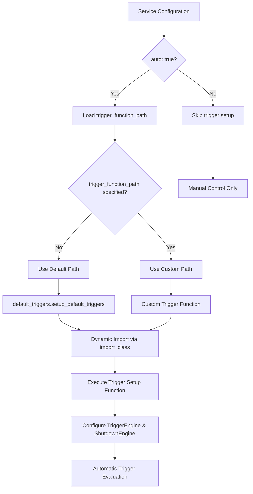

### Архитектура системы триггеров

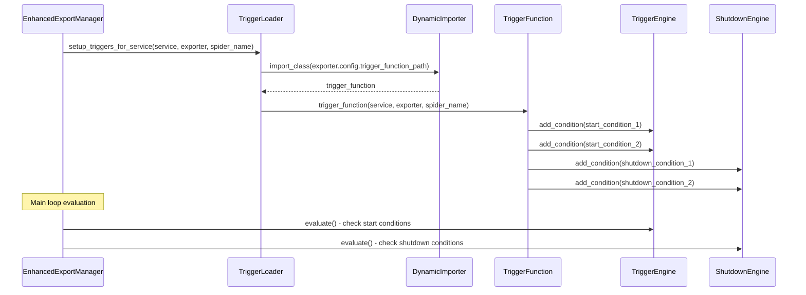

### Интерфейс триггерных функций

#### Стандартная сигнатура

```python
def setup_triggers(service: ExporterService, exporter: BaseExporter, spider_name: str) -> None:
    """
    Настройка триггеров для сервиса экспорта
    
    Args:
        service: Экземпляр ExporterService с trigger_engine и shutdown_engine
        exporter: Экземпляр экспортера с конфигурацией
        spider_name: Имя сервиса для дополнительных проверок
        
    Функция должна:
    1. Настроить условия запуска через service.trigger_engine.add_condition()
    2. Настроить условия завершения через service.shutdown_engine.add_condition()
    3. При необходимости изменить операторы оценки (ALL/ANY/CUSTOM)
    """
```

#### Доступные движки триггеров

```python
# Движок триггеров запуска
service.trigger_engine.add_condition(condition_function)
service.trigger_engine.set_operator(ConditionOperator.ALL)  # Все условия должны быть True
service.trigger_engine.set_operator(ConditionOperator.ANY)  # Любое условие True
service.trigger_engine.set_operator(ConditionOperator.CUSTOM)  # Кастомная логика

# Движок триггеров завершения  
service.shutdown_engine.add_condition(condition_function)
service.shutdown_engine.set_operator(ConditionOperator.ALL)  # По умолчанию
```

### Дефолтные триггеры

#### Реализация (default_triggers.py)

```python
def setup_default_triggers(service: ExporterService, exporter: BaseExporter, spider_name: str) -> None:
    """Дефолтная настройка триггеров для сервиса экспорта"""
    from .db import are_all_parsers_finished
    
    # Триггер запуска - проверяет наличие элементов в очереди
    service.trigger_engine.add_condition(
        lambda: service.redis_conn.llen(exporter.config.queue_name) > 0
    )

    # Триггеры завершения работы сервиса
    # 1. Все парсеры для данного spider завершили работу
    service.shutdown_engine.add_condition(
        lambda: are_all_parsers_finished(spider_name)
    )
    # 2. Очередь обработки пуста
    service.shutdown_engine.add_condition(
        lambda: service.redis_conn.llen(exporter.config.queue_name) == 0
    )
```

#### Логика дефолтных триггеров

- **Запуск**: когда в очереди есть элементы для обработки
- **Завершение**: когда все парсеры завершили работу И очередь пуста
- **Оператор**: ALL (все условия должны выполняться)

### Кастомные триггеры

#### Пример 1: Временные ограничения

```python
def setup_time_based_triggers(service: ExporterService, exporter: BaseExporter, spider_name: str) -> None:
    """Триггеры с временными ограничениями (рабочие часы)"""
    import datetime
    from aragog_exporter_service.utils.db import are_all_parsers_finished
    
    def is_working_hours() -> bool:
        """Проверка рабочих часов (9:00 - 18:00)"""
        now = datetime.datetime.now()
        return 9 <= now.hour < 18
    
    def has_minimum_queue_size() -> bool:
        """Минимум 100 элементов в очереди"""
        try:
            queue_size = service.redis_conn.llen(exporter.config.queue_name)
            return queue_size >= 100
        except:
            return False
    
    # Запуск: только в рабочие часы и при минимальном размере очереди
    service.trigger_engine.add_condition(is_working_hours)
    service.trigger_engine.add_condition(has_minimum_queue_size)
    
    # Завершение: стандартные условия + нерабочее время
    service.shutdown_engine.add_condition(
        lambda: are_all_parsers_finished(spider_name)
    )
    service.shutdown_engine.add_condition(
        lambda: service.redis_conn.llen(exporter.config.queue_name) == 0
    )
    service.shutdown_engine.add_condition(
        lambda: not is_working_hours()  # Завершение в нерабочее время
    )
```

#### Пример 2: Приоритетные очереди

```python
def setup_priority_triggers(service: ExporterService, exporter: BaseExporter, spider_name: str) -> None:
    """Триггеры с поддержкой приоритетных очередей"""
    from aragog_exporter_service.utils.db import are_all_parsers_finished
    
    priority_queue = f"{exporter.config.queue_name}:priority"
    
    def has_priority_items() -> bool:
        """Есть приоритетные элементы"""
        try:
            return service.redis_conn.llen(priority_queue) > 0
        except:
            return False
    
    def has_regular_items_and_low_load() -> bool:
        """Обычные элементы при низкой нагрузке"""
        try:
            queue_size = service.redis_conn.llen(exporter.config.queue_name)
            priority_size = service.redis_conn.llen(priority_queue)
            return priority_size == 0 and queue_size > 1000
        except:
            return False
    
    # Запуск: приоритетные элементы ИЛИ обычные при низкой нагрузке
    service.trigger_engine.set_operator(service.trigger_engine.ConditionOperator.ANY)
    service.trigger_engine.add_condition(has_priority_items)
    service.trigger_engine.add_condition(has_regular_items_and_low_load)
    
    # Завершение: обе очереди пусты
    service.shutdown_engine.add_condition(
        lambda: are_all_parsers_finished(spider_name)
    )
    service.shutdown_engine.add_condition(
        lambda: (service.redis_conn.llen(exporter.config.queue_name) == 0 and 
                service.redis_conn.llen(priority_queue) == 0)
    )
```

### Конфигурация триггеров

#### Дефолтные триггеры (без указания trigger_function_path)

```yaml
exporters:
  standard_service:
    type: "organization"
    auto: true # Автоматический режим
    # trigger_function_path не указан - используется дефолт
    exporter_class_path: "cartography.CartographyOrgDataExporter"
    redis_url: "${REDIS_252_URI}"
    pg_url: "${PG_222_URI}"
    queue_name: "standard_service:items"
    max_workers: 5
    source_name: "Standard Service"
```

#### Кастомные триггеры

```yaml
exporters:
  # Сервис с временными ограничениями
  time_restricted_service:
    type: "reviews"
    auto: true
    trigger_function_path: "example_custom_triggers.setup_time_based_triggers"
    exporter_class_path: "reviews.ReviewsExporter"
    redis_url: "${REDIS_252_URI}"
    ch_dict:
      host: "${CLICKHOUSE_HOST}"
      port: "${CLICKHOUSE_PORT}"
      username: "${CLICKHOUSE_USER}"
      password: "${CLICKHOUSE_PASSWORD}"
      database: "restricted_db"
    queue_name: "time_restricted:items"
    max_workers: 3
    source_name: "Time Restricted Service"

  # Сервис с приоритетными очередями
  priority_service:
    type: "organization"
    auto: true
    trigger_function_path: "example_custom_triggers.setup_priority_triggers"
    exporter_class_path: "cartography.CartographyOrgDataExporter"
    redis_url: "${REDIS_252_URI}"
    pg_url: "${PG_222_URI}"
    queue_name: "priority_service:items"
    max_workers: 10
    source_name: "Priority Service"

  # Ручной сервис (триггеры игнорируются)
  manual_service:
    type: "organization"
    auto: false # trigger_function_path не используется
    trigger_function_path: "will.be.ignored" # Игнорируется для auto=false
    exporter_class_path: "cartography.CartographyOrgDataExporter"
    redis_url: "${REDIS_252_URI}"
    pg_url: "${PG_222_URI}"
    queue_name: "manual:items"
    max_workers: 1
    source_name: "Manual Service"
```

### Hot Reload триггеров

#### Через конфигурацию

```yaml
# До изменения
service_name:
  trigger_function_path: "old_triggers.setup_basic_triggers"

# После изменения
service_name:
  trigger_function_path: "new_triggers.setup_advanced_triggers"
```

#### API перезагрузки

```bash
# Перезагрузка конфигурации (включая триггеры)
curl -X POST "http://localhost:8000/config/reload"

# Принудительная перезагрузка конкретного сервиса
curl -X POST "http://localhost:8000/config/reload?spider_name=service_name"

# Пересоздание сервиса с новыми триггерами
curl -X POST "http://localhost:8000/recreate" \
  -H "Content-Type: application/json" \
  -d '{"spider_names": ["service_name"]}'
```

### Отладка и мониторинг триггеров

#### Логирование

```python
# В кастомных триггерах можно добавлять логирование
def setup_debug_triggers(service: ExporterService, exporter: BaseExporter, spider_name: str) -> None:
    from aragog_exporter_service.utils.logger import get_logger
    logger = get_logger(f"triggers.{spider_name}")
    
    def debug_condition() -> bool:
        result = service.redis_conn.llen(exporter.config.queue_name) > 0
        logger.info(f"Trigger condition for {spider_name}: queue_size > 0 = {result}")
        return result
    
    service.trigger_engine.add_condition(debug_condition)
```

#### Telegram уведомления

```
🎯 Custom triggers loaded for service: Priority Service (priority_service)
⚡ Time-based trigger activated for time_restricted_service  
🔄 Hot reload: Updated triggers for service_name
❌ Trigger error: Failed to evaluate condition for custom_service
```

### Лучшие практики

#### Создание кастомных триггеров

1. **Импорты внутри функции** - избегайте глобальных импортов
2. **Обработка ошибок** - используйте try/except для внешних зависимостей
3. **Логирование** - добавляйте информативные логи для отладки
4. **Тестирование** - создавайте юнит-тесты для триггерных функций
5. **Документация** - добавляйте подробные docstring'и

#### Производительность

1. **Легкие проверки** - триггеры вызываются каждые `check_interval` секунд
2. **Кэширование** - используйте кэш для дорогих операций
3. **Асинхронность** - избегайте блокирующих операций в триггерах
4. **Таймауты** - добавляйте таймауты для внешних вызовов

#### Безопасность

1. **Валидация входных данных** - проверяйте все внешние источники
2. **Изоляция ошибок** - не допускайте падения всей системы
3. **Права доступа** - ограничивайте доступ к критичным ресурсам
4. **Аудит** - логируйте все важные события триггеров

---

## 14. Dupefilter Prefill System

### Описание

Система предварительного заполнения фильтров дубликатов обеспечивает
настраиваемое заполнение Redis SET'ов для исключения обработки дублирующихся
элементов данных. Система интегрирована на уровне конкретных экспортёров и
выполняется при создании сервисов.

### Архитектура системы

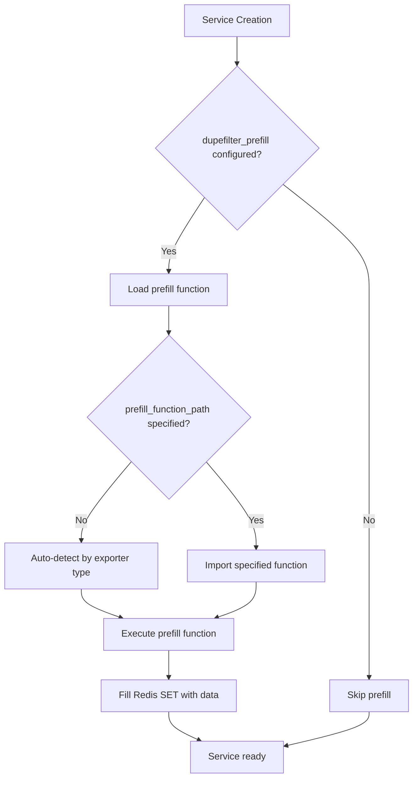

### Компоненты системы

#### DupefilterPrefillLoader

**Местоположение**: `aragog_exporter_service/utils/dupefilter_prefill_loader.py`

**Основные функции:**

```python
def execute_dupefilter_prefill(exporter_config: ExporterConfig, spider_name: str, telegram_notifier=None) -> None
    """Выполняет предварительное заполнение фильтра дубликатов для конкретного экспортёра"""

def fill_reviews_dupefilter_by_source(source_id: str, dupefilter_key: str, redis_uri: str, **kwargs) -> None
    """Стандартная функция для заполнения фильтра дубликатов reviews из ClickHouse"""

def _detect_exporter_type(exporter_config: ExporterConfig) -> Optional[str]
    """Автоматическое определение типа экспортёра"""
```

#### Интеграция в точки создания сервисов

Система интегрирована в следующие методы `EnhancedExportManager`:

- `_setup_services()` - при запуске системы
- `_add_new_service()` - при hot reload конфигурации
- `_recreate_service_config()` - при пересоздании сервиса

### Конфигурация системы

#### Базовая конфигурация

```yaml
exporters:
  reviews_service:
    dupefilter_key: "reviews:dupefilter" # Обязательно для prefill
    dupefilter_prefill:
      source_id: "source_33" # ID источника данных
```

#### Расширенная конфигурация

```yaml
exporters:
  advanced_reviews:
    dupefilter_key: "advanced:dupefilter"
    dupefilter_prefill:
      source_id: "source_47"
      prefill_function_path: "custom_prefills.advanced_fill"
      batch_size: 5000 # Кастомный параметр
      filter_condition: "date >= '2023-01-01'" # Дополнительный параметр
      custom_table: "filtered_reviews" # Специфичный для кастомной функции
```

### Автоматическое определение функций prefill

#### Встроенные типы экспортёров

- **reviews**: `fill_reviews_dupefilter_by_source` - заполнение из ClickHouse
  таблицы `{source_id}.raw_reviews`
- **organization**: prefill не применяется (организационные данные обычно не
  требуют предзаполнения)

#### Логика определения

```python
DEFAULT_PREFILL_FUNCTIONS = {
    "reviews": "aragog_exporter_service.utils.dupefilter_prefill_loader.fill_reviews_dupefilter_by_source"
}

def _detect_exporter_type(exporter_config: ExporterConfig) -> Optional[str]:
    # 1. Анализ exporter_class_path
    if "review" in exporter_config.exporter_class_path.lower():
        return "reviews"
    
    # 2. Анализ конфигурации баз данных
    if exporter_config.ch_dict:
        return "reviews"
    elif exporter_config.pg_url:
        return "organization"
```

### Создание кастомных prefill функций

#### Сигнатура функции prefill

```python
def custom_prefill_function(source_id: str, dupefilter_key: str, redis_uri: str, **kwargs) -> None:
    """
    Кастомная функция prefill
    
    Args:
        source_id: ID источника данных
        dupefilter_key: Ключ для Redis SET
        redis_uri: URI подключения к Redis
        **kwargs: Дополнительные параметры из конфигурации
    """
    pass
```

#### Пример кастомной функции

```python
def fill_filtered_reviews_dupefilter(source_id: str, dupefilter_key: str, redis_uri: str, 
                                   filter_condition: str = None, batch_size: int = 1000, **kwargs) -> None:
    """Заполнение dupefilter с фильтрацией по дате"""
    import clickhouse_connect
    import redis as redis_lib
    
    # Построение запроса с фильтром
    query = f"SELECT source_review_id FROM {source_id}.raw_reviews"
    if filter_condition:
        query += f" WHERE {filter_condition}"
    
    clickhouse_client = clickhouse_connect.get_client(**get_ch_config(source_id))
    redis_server = redis_lib.from_url(redis_uri)
    
    # Batch обработка
    with clickhouse_client.query_row_block_stream(query) as stream:
        batch = []
        for block in stream:
            for row in block:
                batch.append(row[0])
                if len(batch) >= batch_size:
                    redis_server.sadd(dupefilter_key, *batch)
                    batch = []
        
        # Обработка остатка
        if batch:
            redis_server.sadd(dupefilter_key, *batch)
    
    clickhouse_client.close()
    redis_server.close()
```

### Мониторинг и отладка

#### Логирование

Система использует структурированное логирование:

```python
logger.info(f"Starting dupefilter prefill for {spider_name} using {prefill_function_path}")
logger.info(f"Completed dupefilter prefill for {spider_name}")
logger.exception(f"Failed to execute dupefilter prefill for {spider_name}: {e}")
```

#### Telegram уведомления

```
Start dupefilter prefill for tripadvisor_reviews
Completed dupefilter prefill for tripadvisor_reviews
Error: Failed to execute dupefilter prefill for service_name: Connection refused
```

#### Обработка ошибок

- Ошибки prefill не блокируют создание сервиса
- Подробная информация об ошибках отправляется в Telegram
- Exception propagation позволяет отследить проблемы

### Миграция с централизованной системы

#### Старая конфигурация (deprecated)

```yaml
# УСТАРЕВШАЯ СТРУКТУРА - больше не поддерживается
dupefilter_prefill:
  - spider_name: "tripadvisor_reviews"
    source_id: "source_33"
    dupefilter_key: "tripadvisor:reviews_dupefilter"
```

#### Новая конфигурация

```yaml
exporters:
  tripadvisor_reviews:
    dupefilter_key: "tripadvisor:reviews_dupefilter"
    dupefilter_prefill:
      source_id: "source_33"
```

#### Преимущества новой системы

1. **Декуплинг**: каждый экспортёр управляет своим prefill
2. **Гибкость**: поддержка разных источников данных и стратегий
3. **Производительность**: prefill выполняется только при создании конкретного
   сервиса
4. **Масштабируемость**: легко добавлять новые типы prefill функций
5. **Кастомизация**: полная настройка параметров для каждого сервиса

### Best Practices

#### Производительность

1. **Batch операции**: используйте `redis.sadd()` с множественными элементами
2. **Streaming**: используйте `query_row_block_stream` для больших datasets
3. **Connection pooling**: переиспользуйте соединения при возможности
4. **Memory management**: не загружайте весь dataset в память

#### Надёжность

1. **Error handling**: обрабатывайте все возможные исключения
2. **Resource cleanup**: всегда закрывайте соединения
3. **Timeouts**: добавляйте таймауты для внешних операций
4. **Validation**: проверяйте входные параметры

#### Мониторинг

1. **Progress logging**: логируйте прогресс для больших операций
2. **Metrics collection**: собирайте метрики времени выполнения
3. **Health checks**: добавляйте проверки доступности источников
4. **Alerts**: настройте уведомления об ошибках prefill
